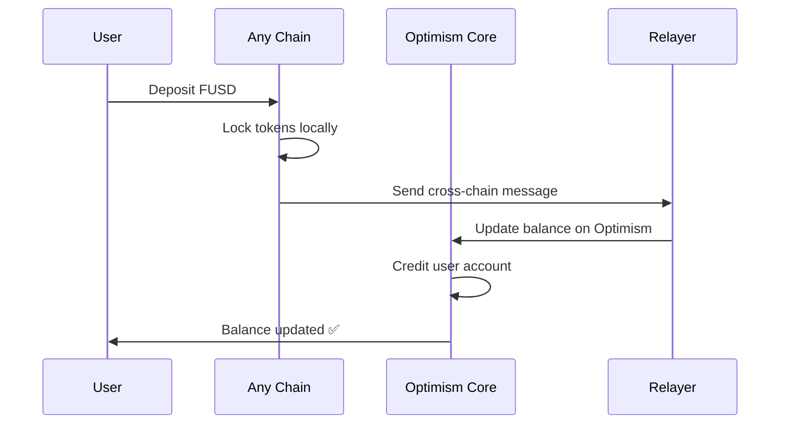
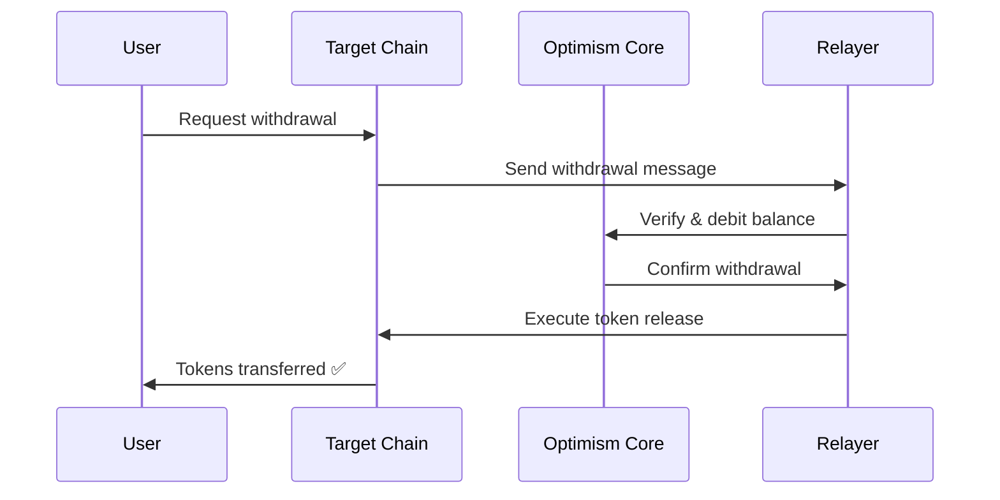

# 🌉 Midway - Cross-Chain Payment Infrastructure

<div align="center">


**Seamless cross-chain payments across 8 blockchain networks**

[](LICENSE)
[](#supported-chains)
[](#deployment)

[🚀 Live Demo](#) • [📖 Documentation](#) • [🔧 Deploy](#getting-started) • [🤝 Contribute](#contributing)

</div>

---

## 🎯 What is Midway?

**Midway** is a revolutionary cross-chain payment infrastructure that enables seamless token transfers and balance management across multiple blockchain networks. Think of it as a **universal wallet** that abstracts away the complexity of managing assets across different chains.

### ✨ Key Benefits

- 🔄 **Unified Balance Management** - Single balance tracked across all chains
- ⚡ **Instant Cross-Chain Transfers** - No bridges, no waiting
- 💰 **Gas Optimization** - Deposit on cheap chains, withdraw anywhere
- 🛡️ **Secure Architecture** - Battle-tested smart contracts
- 🌐 **Multi-Chain Native** - Built for a multi-chain future

---

## 🏗️ Core Architecture

Midway operates on a **hub-and-spoke model** with Optimism Sepolia as the central hub:

```
┌─────────────────┐    ┌─────────────────┐    ┌─────────────────┐
│   Ethereum      │    │   Base Sepolia  │    │  Polygon Amoy   │
│   Sepolia       │    │                 │    │                 │
│  ┌───────────┐  │    │  ┌───────────┐  │    │  ┌───────────┐  │
│  │ MidPay    │◄─┼────┼─►│ MidPay    │◄─┼────┼─►│ MidPay    │  │
│  │ Client    │  │    │  │ Client    │  │    │  │ Client    │  │
│  └───────────┘  │    │  └───────────┘  │    │  └───────────┘  │
└─────────────────┘    └─────────────────┘    └─────────────────┘
        ▲                       ▲                       ▲
        │                       │                       │
        └───────────────────────┼───────────────────────┘
                                ▼
                    ┌─────────────────────────┐
                    │    Optimism Sepolia     │
                    │      (Core Hub)         │
                    │   ┌─────────────────┐   │
                    │   │   MidPay Core   │   │
                    │   │  (Balances &    │   │
                    │   │   Management)   │   │
                    │   └─────────────────┘   │
                    │                         │
                    │   ┌─────────────────┐   │
                    │   │ Cross-Chain     │   │
                    │   │    Relayer      │   │
                    │   └─────────────────┘   │
                    └─────────────────────────┘
```

### 🔧 Component Overview

| Component | Location | Purpose |
|-----------|----------|---------|
| **MidPay Core** | Optimism Sepolia | Central balance management & coordination |
| **MidPay Client** | All other chains | Local operations & message routing |
| **External Routers** | All chains | Cross-chain message passing |
| **Cross-Chain Relayer** | Off-chain service | Automated message relay between chains |

---

## 🌐 Supported Chains

<div align="center">

| Chain | Chain ID | Status | Features |
|-------|----------|--------|----------|
| 🔴 **Optimism Sepolia** | 11155420 | ✅ Hub | Core contracts, balance management |
| ⚫ **Ethereum Sepolia** | 11155111 | ✅ Active | Full deposit/withdraw support |
| 🟣 **Zora Sepolia** | 999999999 | ✅ Active | NFT-focused ecosystem integration |
| 🔵 **Base Sepolia** | 84532 | ✅ Active | Coinbase L2 integration |
| 🟠 **Polygon Amoy** | 80002 | ✅ Active | Low-cost transactions |
| 🌍 **Worldchain Sepolia** | 4801 | ✅ Active | Identity-verified network |
| 🖋️ **Ink Sepolia** | 763373 | ✅ Active | Creator economy focus |
| 🦄 **Unichain Sepolia** | 1301 | ✅ Active | DeFi-optimized network |

</div>

---

## 🔄 How It Works

### 1. **Deposit Flow** 💰



### 2. **Withdrawal Flow** 💸



### 3. **Cross-Chain Messaging** 📡

- **External Routers** handle message queuing and routing
- **Automated Relayer** processes messages between chains
- **Message verification** ensures security and prevents double-spending
- **Retry logic** handles network failures gracefully

---

## 🚀 Getting Started

### Prerequisites

- Node.js 18+ and Bun
- MetaMask or compatible wallet
- Testnet ETH on supported chains

### Frontend Setup

```bash
# Clone the repository
git clone https://github.com/heetprox/midway.git
cd midway

# Install frontend dependencies
cd client
bun install

# Start development server
bun run dev
```

### Backend Setup (Relayer)

```bash
# Navigate to server directory
cd server
bun install

# Set up environment variables
cp .env.example .env
# Add your private keys and RPC URLs

# Start the relayer
bun run start
```

### Environment Configuration

Create `.env` files with the following:

```env
# Backend (.env)
BOT_PRIVATE_KEY=your_relayer_private_key
OPTIMISM_SEPOLIA_RPC_URL=https://sepolia.optimism.io
ETH_SEPOLIA_RPC_URL=https://sepolia.infura.io/v3/your-key
ZORA_SEPOLIA_RPC_URL=https://sepolia.rpc.zora.energy
BASE_SEPOLIA_RPC_URL=https://sepolia.base.org
POLYGON_AMOY_RPC_URL=https://rpc-amoy.polygon.technology
WORLDCHAIN_SEPOLIA_RPC_URL=https://worldchain-sepolia.g.alchemy.com/public
INK_SEPOLIA_RPC_URL=https://rpc-gel-sepolia.inkonchain.com
UNICHAIN_SEPOLIA_RPC_URL=https://sepolia.unichain.org
```

---

## 💡 Key Features

### 🎨 **Beautiful UI/UX**
- Responsive design that works on all devices
- Real-time balance updates
- Intuitive network switching
- Clear transaction status feedback

### 🔒 **Security First**
- Multi-signature architecture
- Automated security checks
- Rate limiting and spam protection
- Comprehensive error handling

### ⚡ **Performance Optimized**
- Smart contract gas optimization
- Efficient message routing
- Parallel transaction processing
- Caching for improved UX

### 🛠️ **Developer Friendly**
- TypeScript throughout
- Comprehensive testing
- Clear documentation
- Modular architecture

---

## 🎯 Use Cases

### 🏪 **For Merchants**
- Accept payments on any supported chain
- Settle in preferred currency/chain
- Reduce gas costs through optimal routing
- Simplified multi-chain treasury management

### 👤 **For Users**
- Unified balance across all chains
- Pay with tokens on cheapest available chain
- Seamless cross-chain experience
- No manual bridging required

### 🏢 **For dApps**
- Integrate cross-chain payments easily
- Access liquidity from multiple chains
- Reduce user onboarding friction
- Enable chain-agnostic user experiences

---

## 🔧 Technical Specifications

### Smart Contracts

| Contract | Network | Address | Purpose |
|----------|---------|---------|---------|
| MidPayCore | Optimism Sepolia | `0x895cCb...` | Central balance management |
| MidPayClient | Ethereum Sepolia | `0x9E86ca...` | Local operations |
| MidPayClient | Zora Sepolia | `0xfd0A25...` | Local operations |
| External Router | All chains | Various | Message routing |

### Token Standard
- **FUSD**: Custom testnet token for demonstration
- **Decimals**: 18
- **Mintable**: Yes (testnet only)

### Gas Optimization
- Batch operations where possible
- Efficient storage patterns
- Minimal cross-chain message size
- Smart retry mechanisms

---

## 🧪 Testing

### Run Tests

```bash
# Frontend tests
cd client
bun test

# Smart contract tests
cd contracts
forge test

# Integration tests
bun run test:integration
```

### Test Coverage

- ✅ Unit tests for all components
- ✅ Integration tests for cross-chain flows
- ✅ End-to-end testing
- ✅ Security audit preparation

---

## 🚧 Roadmap

### Phase 1: Foundation ✅
- [x] Core architecture implementation
- [x] 8-chain support
- [x] Basic UI/UX
- [x] Cross-chain messaging

### Phase 2: Enhancement 🚧
- [ ] Mainnet deployment preparation
- [ ] Advanced security features
- [ ] Performance optimizations
- [ ] Mobile app development

### Phase 3: Expansion 📋
- [ ] Additional chain integrations
- [ ] DeFi protocol integrations
- [ ] Governance token launch
- [ ] DAO formation

---

## 🤝 Contributing

We welcome contributions! Please see our [Contributing Guide](CONTRIBUTING.md) for details.

### Development Process
1. Fork the repository
2. Create a feature branch
3. Make your changes
4. Add tests
5. Submit a pull request

### Code Style
- Use TypeScript for type safety
- Follow ESLint configuration
- Add comprehensive comments
- Write tests for new features

---

## 📄 License

This project is licensed under the MIT License - see the [LICENSE](LICENSE) file for details.

---

## 🔗 Links

- **Website**: [midway.fi](#)
- **Documentation**: [docs.midway.fi](#)
- **Discord**: [Join our community](#)
- **Twitter**: [@MidwayProtocol](#)
- **GitHub**: [github.com/midway-protocol](#)

---

<div align="center">

**Built with ❤️ for the multi-chain future**

*Midway - Bridging the gap between chains, one transaction at a time.*

[](#)
[](#)

</div>